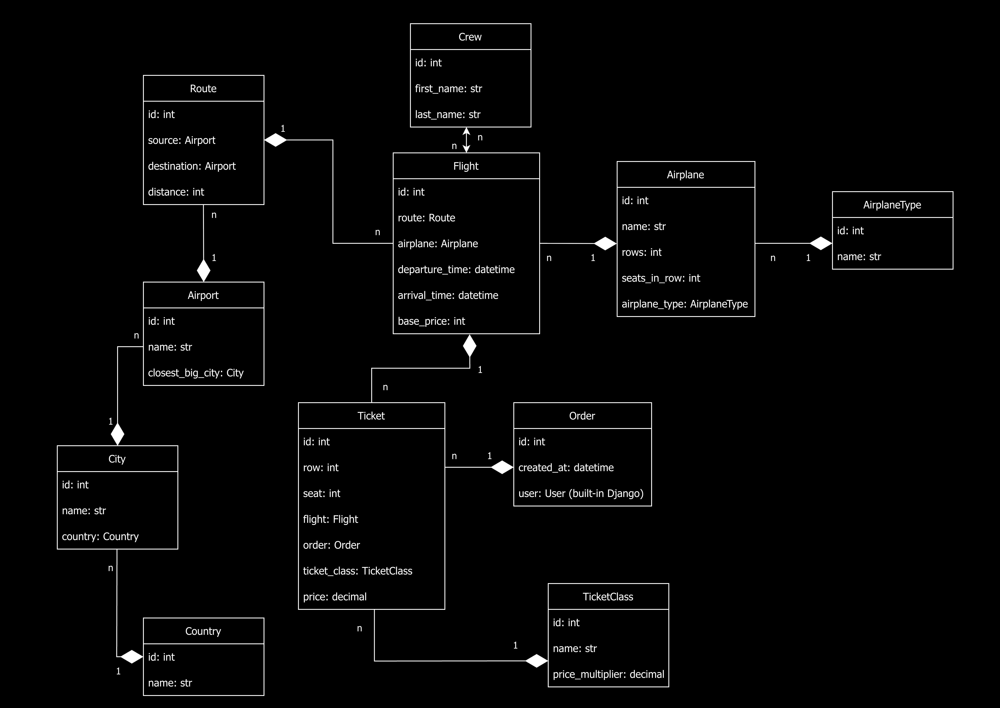
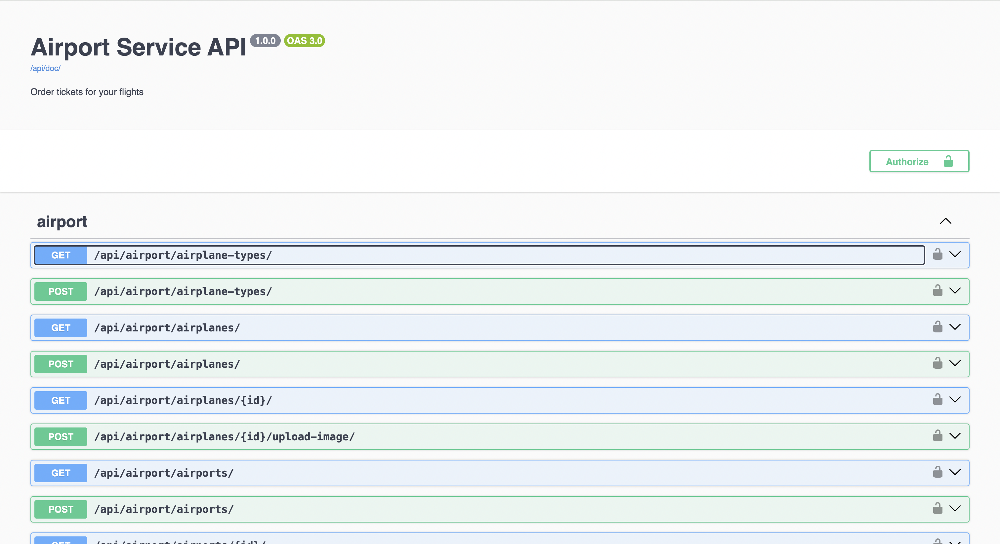
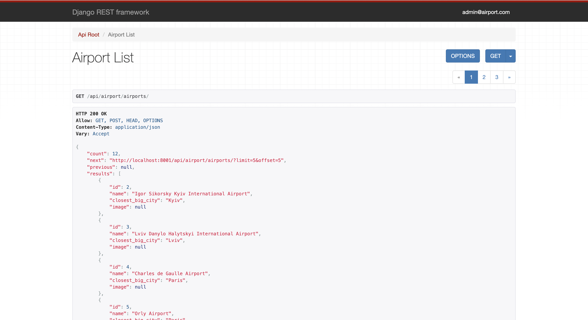
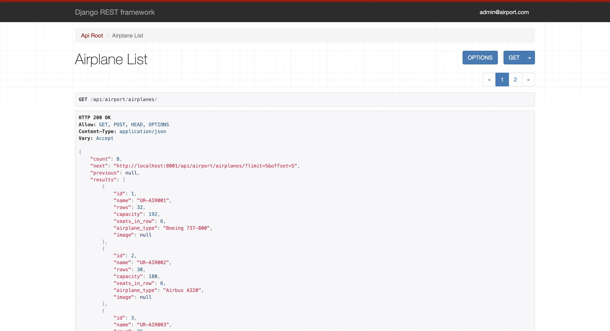
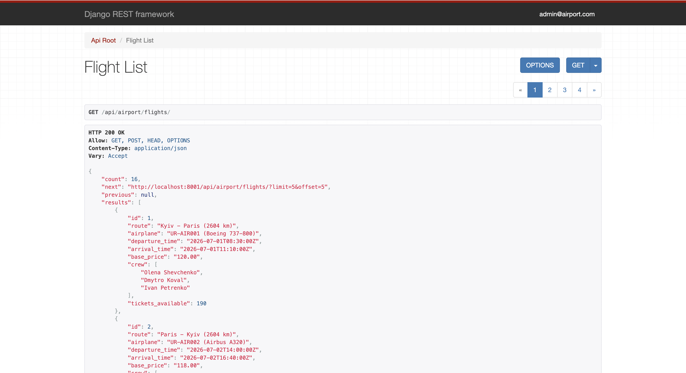
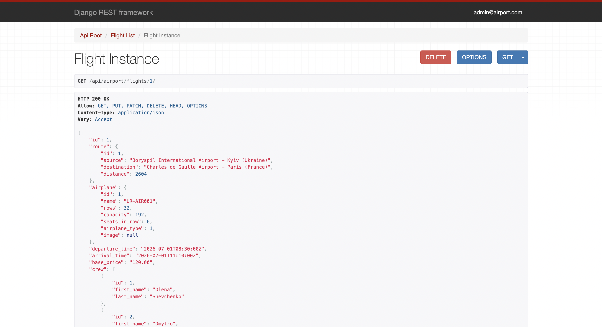
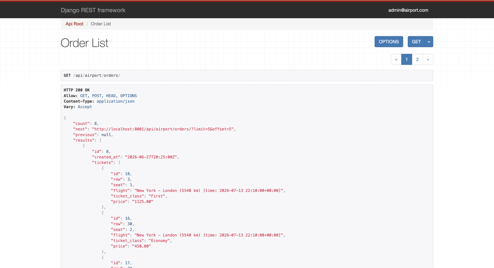
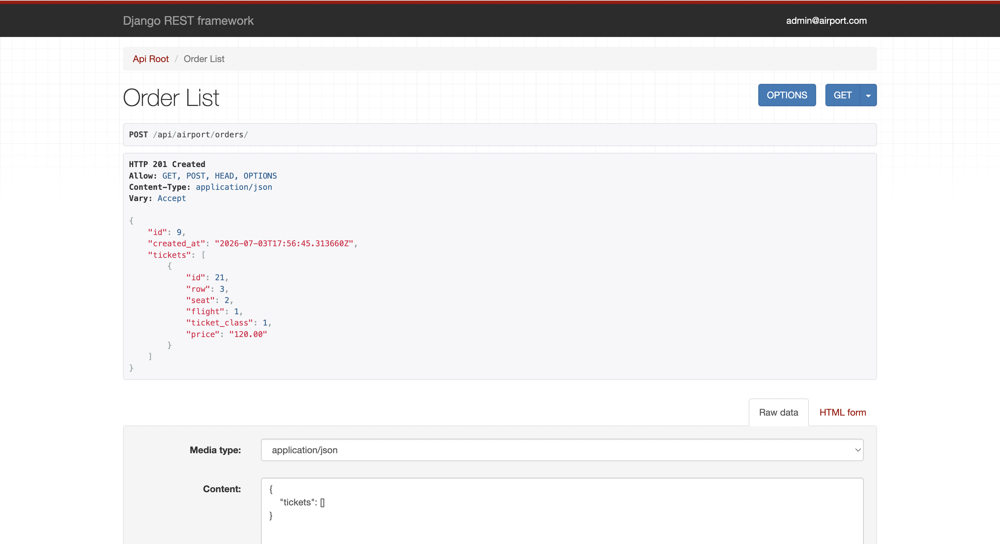
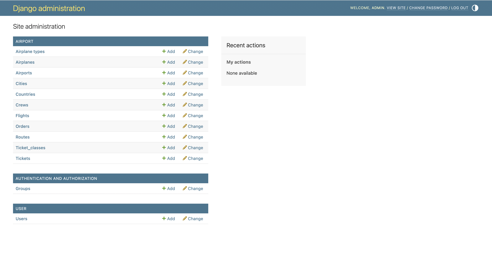

# Airport API

API service for airport management written with Django REST Framework.

## Contents

- [Installing using GitHub](#installing-using-github)
- [Run locally](#run-locally)
  - [Using PostgreSQL from Docker with local Django](#using-postgresql-from-docker-with-local-django)
- [Run with Docker](#run-with-docker)
- [Demo data](#demo-data)
  - [Load demo data locally](#load-demo-data-locally)
  - [Load demo data with Docker](#load-demo-data-with-docker)
- [Getting access](#getting-access)
- [Running tests](#running-tests)
  - [Run tests locally](#run-tests-locally)
  - [Run tests with Docker](#run-tests-with-docker)
- [Features](#features)
- [DB Structure](#db-structure)
- [Screenshots](#screenshots)

## Installing using GitHub

```bash
git clone https://github.com/idubina/airport-api-service.git
cd airport-api-service

python -m venv venv
source venv/bin/activate

pip install -r requirements.txt
```

Create a `.env` file based on `.env.sample`.

## Run locally

For local development, PostgreSQL should be available on your machine.

If you use a local PostgreSQL installation or run only the PostgreSQL container, set:

```env
POSTGRES_HOST=localhost
POSTGRES_PORT=5432
```

Then run:

```bash
python manage.py migrate
python manage.py runserver
```

The API will be available at:

```text
http://localhost:8000/
```

### Using PostgreSQL from Docker with local Django

If you want to run Django locally, but use PostgreSQL from Docker, start only the database service:

```bash
docker compose up -d db
```

Then run Django locally:

```bash
python manage.py migrate
python manage.py runserver
```

Note: local Django connects to PostgreSQL through `localhost`, so `POSTGRES_HOST` should be set to `localhost` in this case.

## Run with Docker

Docker should be installed.

Create a `.env` file based on `.env.sample`.

For Docker usage, keep:

```env
POSTGRES_HOST=db
POSTGRES_PORT=5432
```

Build and start the containers:

```bash
docker compose up --build
```

The API will be available at:

```text
http://localhost:8001/
```

Note: when Django runs inside Docker, it connects to PostgreSQL by the database service name, so `POSTGRES_HOST` should be set to `db`.

## Demo data

The project includes demo data that can be used for testing and reviewing the API.

Demo data is stored in:

```text
airport_big_fixture.json
```

Demo users and credentials are stored in:

```text
demo_users.txt
```

Make sure database migrations are already applied before loading demo data.

### Load demo data locally

```bash
python manage.py loaddata airport_big_fixture.json
```

### Load demo data with Docker

```bash
docker compose exec app python manage.py loaddata airport_big_fixture.json
```

If the `app` service is not running yet, use:

```bash
docker compose run --rm app sh -c "python manage.py wait_for_db && python manage.py loaddata airport_big_fixture.json"
```

After loading the fixture, you can use credentials from `demo_users.txt` to authenticate and test the API.

Get access token via:

```text
/api/user/token/
```

Then use the token in requests:

```text
Authorization: Bearer <your access token>
```

Note: demo credentials are provided only for testing and reviewing purposes.

## Getting access

- create a user via `/api/user/register/`
- get access token via `/api/user/token/`
- use the token in requests:

```text
Authorization: Bearer <your access token>
```

## Running tests

The project includes tests for API endpoints, authentication, permissions, serializers and business logic.

### Run tests locally

```bash
python manage.py test
```

### Run tests with Docker

If the project is running with Docker, use:

```bash
docker compose exec app python manage.py test
```

If the `app` service is not running yet, use:

```bash
docker compose run --rm app sh -c "python manage.py wait_for_db && python manage.py test"
```

## Features

- JWT authentication
- Custom user model with email authentication
- Admin panel `/admin/`
- API documentation with Swagger `/api/doc/swagger/`
- API documentation with Redoc `/api/doc/redoc/`
- Managing countries, cities and airports
- Managing routes between airports
- Managing crews
- Managing airplane types and airplanes
- Airport and airplane image upload
- Managing flights
- Filtering flights by price, route, airplane, crew, cities and dates
- Showing available tickets for flights
- Showing taken places on flight detail
- Managing ticket classes
- Creating orders with nested tickets
- Automatic ticket price calculation
- User-specific order access
- Staff users can view and filter all orders
- API throttling
- Pagination
- PostgreSQL support
- Docker support
- Demo data fixture with test users
- Test coverage for core API functionality

## DB Structure



## Screenshots

### Swagger documentation



### Airport list



### Airplane list



### Flight list



### Flight detail



### Order list



### Order create



### Admin panel



## Author

Illia Dubina  
GitHub: [idubina](https://github.com/idubina)